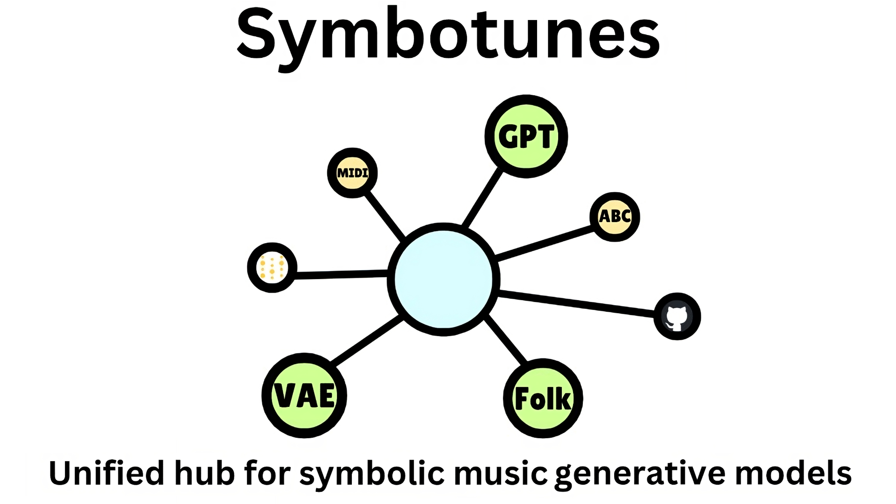

# Symbotunes - Symbolic music model hub

**[ [paper](https://arxiv.org/abs/2410.20515) ] | [ [ISMIR 2024 LBD page](https://ismir2024program.ismir.net/lbd_453.html) ]**



Symbotunes contains modern Python implementations of well-known methods for symbolic music generation, as well as a unified pipeline for generating and training.

Symbotunes has been published at the Late Breaking Demos session at ISMIR 2024.


## Project content

The repository is a hub for models generating music in symbolic formats. Currently the project contains implementations for the following modelss:

* **Folk-RNN** - see https://arxiv.org/pdf/1604.08723.pdf
* **MusicVAE** - see https://arxiv.org/pdf/1803.05428.pdf
* **GPT-2** - see https://aclanthology.org/2020.nlp4musa-1.10.pdf

## Environment setup

Symbotunes uses Anaconda for package management, which can be installed from [here](https://docs.conda.io/projects/conda/en/latest/user-guide/install/linux.html). We also use `git lfs`, which can be installed from [here](https://docs.github.com/en/repositories/working-with-files/managing-large-files/installing-git-large-file-storage).

The following command can be used to create the environment from file:
```sh
conda env create --name wimu --file environment.yml
```

This environment may then be activated with:
```sh
conda activate wimu
```

If the environment is changed by the user, then it should be updated with:
```sh
conda env export --name wimu | grep -v "prefix: " > environment.yml
```

## Training models from scratch
To train model from scratch run the following command:
```sh
python3 -m scripts.train -p CONFIG_FILE
```
where `CONFIG_FILE` is a path to config file of the model you want to train

To train model from checkpoint run:
```sh
python3 -m scripts.train -p CONFIG_FILE -c CKPT_PATH
```
where `CKPT_PATH` is a path to model checkpoint


## Sampling from model
To sample from a model run:
```sh
python3 -m scripts.sample -p CONFIG_FILE -c CKPT_PATH -b BS -o OUT
```
where `BS` is the number of samples you want to generate and `OUT` is a path to directory the samples should be saved to

For instance, you can produce 4 MIDI clips with a pre-trained Folk-RNN by simply calling:

```sh
python3 -m scripts.sample -p models/folk_rnn/configs/config.yaml -c models/folk_rnn/checkpoints/checkpoint.ckpt --b 4 -o ./results
```

## Config file structure

One of the fundamental parts of this project is our custom configuration file parser. It allows us to run different experiments with a single python script, by simply changing the configuration file. The expected structure of the config file looks as follows:

```yaml
model:
  model_type: model-name                                        # name of the model we want to train
  params:
    parameter_name1: parameter_value1                           # hyperparameter of the model that will be passed to the consturctor
    parameter_name3:
        nested_param_name1: nested_param_value1                 # parameters can be nested - this is still a yaml file
        ...
    parameter_name2: parameter_value2
    ...                                                         # other model hyperparameters


dataloaders:
  validation:                                                   # config for validation dataset
    name: "lakh"                                                # name of the dataset
    root: "_data"                                               # path to dataset files
    split: "test"                                               # dataset split - "test", "val" or "train"
    download: True                                              # should the dataset be downoloaded
    transforms:                                                 # transforms applied to data from dataset, they are applied sequentially from top to bottom
      - transform_name1:
            transform_param_name1: transform_param_value1       # param for transform constructor, again can be nested (dict, list etc.) cause it's a normal yaml file
            ...                                                 # other params
      - transform_name2:                                        # if we want to pass no params to transform we still need to add the ":"
      ...                                                       # other transforms


    batch_size: 128                                             # dataloader batch size
    num_workers: 16                                             # dataloader number of workers
    collate_fn: "pad_collate_single_sequence"                   # dataloader collate function

  train:                                                        # config for train dataset, same structure like the validation dataset
    - dataset:
        name: "lakh"                                            # name of the dataset
        root: "_data"                                           # path to dataset files
        split: "test"                                           # dataset split - "test", "val" or "train"
        download: True                                          # should the dataset be downoloaded
        transforms:                                             # transforms applied to data from dataset, they are applied sequentially from top to bottom
        - transform_name1:
                transform_param_name1: transform_param_value1   # param for transform constructor, again can be nested (dict, list etc.) cause it's a normal yaml file
                ...                                             # other params
        - transform_name2:                                      # if we want to pass no params to transform we still need to add the ":"
        ...                                                     # other transforms


        batch_size: 128                                         # dataloader batch size
        num_workers: 16                                         # dataloader number of workers
        collate_fn: "pad_collate_single_sequence"               # dataloader collate function


lightning:                                                      # pytorch lightning parameters
  trainer:                                                      # parameters passed to pytorch_lightning.Trainer class constructor
    benchmark: True
    max_steps: 100000
    accumulate_grad_batches: 4
    ...

callbacks:                                                      # callbacks to run during the experiment
  - callback_name1:
      callback_param_name1: callback_param_value1               # param for callback
      ...
  - callback_name2:                                             # if we want to pass no params to transform we still need to add the ":"
  ...                                                           # other callbacks
```

Implementation of this parser is in the `__init__.py` files: [model section parsing](models/__init__.py), [data section parsing](data/__init__.py), [transforms section parsing](data/transforms/__init__.py), [dataset section parsing](data/datasets/__init__.py) and [callbacks section parsing](callbacks/__init__.py). Currently we have the following values implemented:

* **model_type**:
    * **folk-rnn** - see https://arxiv.org/pdf/1604.08723.pdf
    * **music-vae** - see https://arxiv.org/pdf/1803.05428.pdf
    * **gpt2** - see https://aclanthology.org/2020.nlp4musa-1.10.pdf
* **dataset -> name**:
    * **lakh** - Lakh for MusicVAE, as described in https://arxiv.org/pdf/1803.05428.pdf Contains midi files.
    * **folk-rnn** - folk music in ABC format, see https://arxiv.org/pdf/1604.08723.pdf
* **dataset -> transforms**:
    * **folk_rnn** - tokenizer for ABC format, as described in https://arxiv.org/pdf/1604.08723.pdf, takes string as input, outputs tokenized sequence
    * **midi_tokenizer** - generic miditok REMI midi file tokenizer, takes path to midi file as input, outputs miditok TokSequence
    * **music_vae_tokenizer** - midi tokenizer for MusicVAE model, takes path to midi file as input, outputs miditok TokSequence
    * **sample_bars** - samples n random bars (continous, one bar after another) from the given track. takes TokSequence as input and outputs n sampled bars or the original sequence if the track has less than n bars (as TokSequence)
    * **toksequence_to_tensor** - transforms TokSequence to pytorch Tensor, takes TokSequence as input and outputs pytorch Tensor
    * **sample_subsequence** - samples subsequence of given length from the given sequence (or return the sequence if the sequence is shorter than the expected subsequence)
* **callbacks**:
    * **checkpoint_every_n_steps** - creates a model checkpoint every n training steps
    * **cuda_callback** - after the first epoch, computes memory used by the gpu during
    * **setup_callback** - sets up log directory for the experiment. Creates a directory for model checkpoints, creates a directory with the experiment configuration and saves the experiment configuration (the config file)
    * **model_checkpoint** - saves of the best model and the last model, including on keyboard interrupt

For other details, like model hyperparameters etc. please refer to the implementation.

## Citation

If you find Symbotunes useful, please consider citing our tool:

```tex
@inproceedings{skiers2024symbotunes,
  title={Symbotunes: unified hub for symbolic music generative models},
  author={Skier{\'s}, Pawe{\l} and {\L}azarski, Maksymilian and Kope{\'c}, Micha{\l} and Modrzejewski, Mateusz},
  booktitle={Extended Abstracts for the Late-Breaking Demo Session of the 25th International Society for Music Information Retrieval Conference},
  organization={ISMIR},
  year={2024}
}
```

## Contributing

We also welcome contributions - we encourage PRs with enhancements, additional models, features and other improvements!
